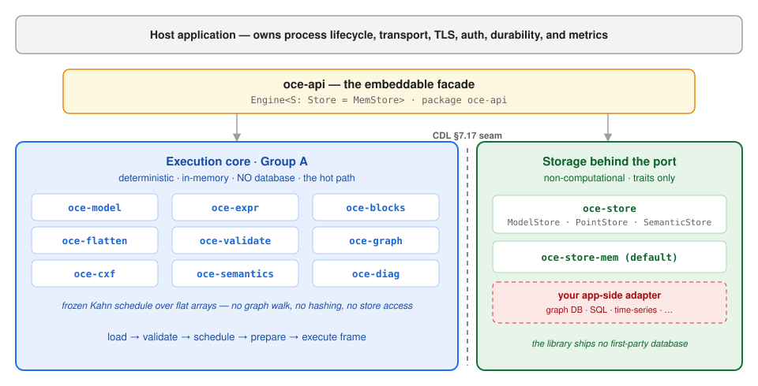
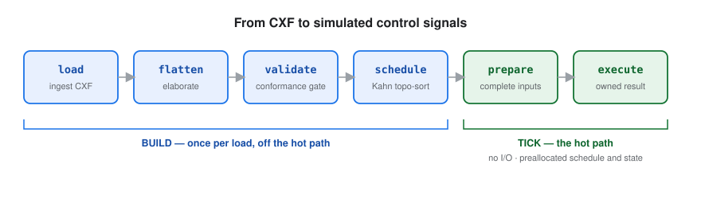

# Open Control Engine

**A high-performance, embeddable Rust control engine that natively executes the OBC / LBL
[Control Description Language (CDL)](https://obc.lbl.gov/specification/cdl.html) for smart-building
equipment control sequences.**

[](#license)
[](rust-toolchain.toml)
[](#the-architectural-spine-the-cdl-717-non-computational-seam)

CDL is a declarative, object-oriented language — a strict subset of Modelica — that expresses
building control logic as block diagrams. Its determinism contract (CDL §7.16: synchronous
data flow + single assignment) means identical inputs and parameters yield identical outputs. The
engine is built to be an **executable specification** on that basis — the same control sequence,
run bit-for-bit reproducibly, for commissioning and continuous functional verification.
Reproducibility is enforced and tested here; agreement with the normative Modelica reference is
not yet (see the goldens note below).

It is designed to be the **core engine under the hood** of larger building-control products: the
public API and core semantics stay small, embeddable, and stable.

---

## Status

The architecture specification is the design of record. It lives in a working directory that is
not part of this repository, so nothing below can be checked against it from a clone — the
implementation is progressing milestone by milestone, each gated by extensive tests.

| Milestone | Scope | State |
| --- | --- | --- |
| **M0** | Deterministic execution core — workspace, types, scheduler, tick loop | ✅ done |
| **M1** | CXF ingest, database-free, end-to-end *load → simulate* | ✅ done |
| **M2** | CDL block-library breadth (G36) + conformance/oracle + parameter validation | ✅ done (in-repo) |
| **M3** | Durability through the `oce-store` port (reference adapter) | 🟡 reference adapter landed (verification-only) |
| **M4** | Docs/point-list export, model-from-semantic, hardening, and `oce-py` PyO3 bindings (MVP) | ⬜ planned |
| **M5** | Python free-threading (`gil_used = false`) + free-threaded wheels + first PyPI publish | ⬜ planned |

Today the engine loads **46 ASHRAE Guideline 36 sequence fixtures** from CXF and simulates them
end-to-end through the frozen facade, against a registry of **133 CDL elementary blocks** — 52
`Reals`, 26 `Logical`, 24 `Integers`, 15 `Routing`, 7 `Discrete`, 4 `Conversions`, 3
`Psychrometrics`, 2 `Utilities`. The workspace suite is over **1300 tests** plus doctests.

Read that as breadth of the fixture corpus, not as a general G36 compiler. Those 46 documents
reference 90 distinct `Buildings.Controls.OBC.ASHRAE.G36.*` class paths, but they are
**pre-flattened CXF** at specific parameterizations. The engine executes the block graph CXF hands
it; it does not parse or flatten Modelica `.mo` sources (see `oce-flatten`).

CXF is bidirectional. `oce-cxf` imports via the §7.1 resolver and **exports** under a round-trip
contract (RT-2): for a graph inside the export subset, re-importing the emitted bytes renders
bit-identically to what was exported, Reals compared by IEEE-754 bits rather than by epsilon.
Export covers the flat, ground, single-root, scalar-parameter subset, and emits the §7.4.1
connector attributes that fall in the canonical subset — `unit`, `quantity`, `displayUnit`, and
finite `min`/`max`; a connector carrying `nominal` or `unbounded` is rejected rather than silently
dropped. Export takes no registry dependency, which leaves two documented ways for an `Ok` export
to produce bytes that fail re-import, both reachable only from a hand-built graph: a block whose
declared port arity contradicts the class its `class_path` names (`MalformedDocument`), and an
unregistered class path (`ClassNotFound`). Every graph the resolver produces is correct by
construction on both axes.

Enum-carrying blocks are deferred rather than fatal: the block and its transitive downstream
consumers are omitted so the enum-free remainder still exports. **`export()` discards those
warnings** — a caller using it alone cannot distinguish a complete export from one that dropped
most of the graph, and the dropped cone can be large (the G36 corpus pins cones of 83 and 63
blocks). Use `export_with_report` to tell the two apart: an empty `warnings` list is what certifies
the round trip covered the whole input. Export is reached through `oce-cxf` directly; the `oce-api`
facade exposes import only.

**What the goldens do and do not prove.** Each of the 46 G36 fixtures carries a whole-sequence
trace and a `.prov.json` recording its provenance, and every one of them records `"tier": "2"` —
**engine self-output, a determinism snapshot and explicitly not a correctness oracle**
(`depends_on_oce_blocks: true`). They catch drift, not wrongness.

Correctness is bounded by a narrower, genuinely independent layer: **9 of those sequences carry
hand-derived Tier-A oracles covering 32 output signals**, generated by `tools/golden-gen` — a
crate held off the workspace and forbidden from depending on `oce-blocks`, so its references are
re-derived from the CDL spec math rather than from the implementation under test. CI enforces that
firewall. **What is not wired is Tier 3 — cross-implementation differential against an external
Modelica / Buildings toolchain.** No sequence here has been executed against the normative
reference implementation; that is the deliberately deferred tail.

The project is **pre-1.0** and not yet published to crates.io.

---

## The architectural spine: the CDL §7.17 non-computational seam

CDL §7.17 states that point lists, trends, display units, tags, and all Brick / Haystack /
ASHRAE 223P semantics **do not affect the computation of a control signal**. That single rule is the
cleanest seam in the system, and the engine is built around it.



- An **execution core** — a small, deterministic, in-memory dataflow machine that sees *only*
  blocks, typed connections, and values. This is the hot path. It has **zero** dependency on any
  database.
- A **storage layer behind a trait** — everything the evaluator must *not* read (equipment topology,
  points, instance structure, parameters, trends, semantic triples) plus durable persistence — is
  reached only through the `oce-store` port traits. The library ships **no first-party database**;
  durable/queryable backends are **app-side adapters** behind the port, with an in-memory default
  (`oce-store-mem`).

A downstream project can embed the engine for *load → flatten → validate → schedule → tick →
simulate* with no database at all.

**Input quality is the host's job, not the engine's.** Staging is deliberately status-agnostic: a
sample is converted from its value regardless of `PointStatus`, so `Fault`, `Stale`, and
`Uninitialized` all stage exactly like `Ok`. A missing sample is not an error either — the
connector holds its previous value indefinitely (before the first sample, the type's
`zero_value()`). The engine therefore implements **no fail-safe policy of its own**. An embedder
driving real equipment must enforce staleness limits, fault reactions, and safe-state fallback in
the host layer above the engine.



---

## Embeddability posture

The engine is, by design:

- **Library-only** — no `main`, no daemon, no server, no network listener. The host owns process
  lifecycle, transport, TLS, authN/Z, multi-tenancy, off-host durability, and metrics export.
- **Synchronous, in-process** — every public method is a blocking synchronous call. **No async
  runtime** is pulled at any layer.
- **`#![forbid(unsafe_code)]`** in every crate.
- **edition 2024, Rust 1.95.0** (pinned in [`rust-toolchain.toml`](rust-toolchain.toml)),
  `resolver = "3"`.
- **Deterministic on the tick** — a frozen, topologically-sorted schedule evaluated over flat
  arrays: no graph walks, no hashing, no allocation, and no store access **in the graph
  evaluator**. That is the scope of the claim. `Engine::tick` itself is store-free only when the
  model declares no store-backed inputs; otherwise it takes one `store.snapshot()` per tick —
  one allocation and one read per staged input — before handing off to the evaluator.

---

## Quickstart

> The facade crate is **`oce-api`** — that is the package name today, and the name the workspace
> publish uses. Releasing it under the umbrella name **`open-control-engine`** is a planned change,
> not a current alias. Until the first crates.io release, depend on it via git:

```toml
[dependencies]
oce-api = { git = "https://github.com/jscott3201/open-control-engine" }
```

A minimal embed — load a CDL sequence from CXF and simulate it (illustrative sketch):

```rust
use oce_api::{CollectSpec, Engine, InputSource, SimSpec, Value};

// 1. An engine with the default in-memory store — no database.
let mut engine = Engine::in_memory();

// 2. Load a CDL sequence from CXF (JSON-LD): parse, validate, freeze the schedule.
engine.load_cxf(cxf_bytes)?;

// 3. Simulate: feed inputs per tick, collect named outputs.
let metrics = engine.simulate(&SimSpec {
    t_start: 0.0,
    t_stop: 4.0,
    step: 1.0,
    inputs: InputSource::Closure(Box::new(|t| {
        vec![("zone_temp".to_string(), Value::Real(22.0 + t))]
    })),
    collect: CollectSpec::Named { points: vec!["sat_setpoint".to_string()], stride: 1 },
})?;
```

---

## The crate map (`oce-*`)

The dependency direction is intentional and acyclic, organized around the seam above.

**Execution core (Group A — no store, no database):**

| Crate | Responsibility |
| --- | --- |
| `oce-model` | Pure value/connector/instance/connection types; the `Value` enum (Real/Integer/Boolean/String/Enum) and the flattened model graph — the shared executable truth. |
| `oce-expr` | The CDL §7.7.2 binding-expression parser/evaluator (closed-world; pure, total). |
| `oce-blocks` | The `Block` trait and the native CDL elementary-block library (stateless `[A]` / stateful `[S]`). |
| `oce-flatten` | Elaboration / CXF-path resolution (CXF arrives pre-flattened; full `.mo` flattening is deferred). |
| `oce-validate` | Loader conformance: subset rejection, single-assignment, type/attribute unification, parameter rules. |
| `oce-graph` | The deterministic scheduler/executor: direct-feedthrough DAG, algebraic-loop rejection, own Kahn topological sort, the tick loop. |
| `oce-cxf` | CXF (Control eXchange Format) JSON-LD ↔ the model graph, both directions. Import is the §7.1 resolver; export emits the flat/ground/scalar subset under the RT-2 round-trip contract, deferring enum-carrying blocks with warnings rather than failing. `export_with_report` surfaces those warnings; plain `export` discards them. |
| `oce-semantics` | Vendor-annotation parsing → effective (non-computational) point/trend/semantic metadata. |
| `oce-diag` | The shared diagnostic vocabulary (`Severity` / `DiagCode` / `Diagnostic`) across the ingest path. |

**Storage ports (the seam — traits only, no database types):**

| Crate | Responsibility |
| --- | --- |
| `oce-store` | **The seam.** The `ModelStore` / `PointStore` / `SemanticStore` traits + DTOs. No database types. |
| `oce-store-mem` | The default in-memory backend, so the engine runs with no database. |
| `oce-reference-wal-adapter` | **Verification-only, `publish = false`.** A `std::fs` WAL + atomic snapshot adapter that exists to prove the frozen seam can carry real durability without a first-party database. Not a supported backend — durable/queryable adapters stay app-side. |

**Verification, externals & host facade:**

| Crate | Responsibility |
| --- | --- |
| `oce-conformance` | The funnel-style tolerance-band / golden-trace conformance harness. |
| `oce-extension` | The FMI / extension-block boundary (v1 surfaces extension blocks as unresolved externals). |
| `oce-docs` | **Reserved seam, not implemented.** The sequence-spec (Word/HTML) and point-list export surface is declared; every exporter is deferred to M4 and `point_list_html` currently panics with `unimplemented!`. |
| `oce-api` | The embeddable host facade: `Engine<S: Store = MemStore>` — the single public surface. Package name is `oce-api`; the `open-control-engine` umbrella name is planned for first publish. |

---

## Testing

This engine controls real equipment, so **a wrong result is a physical hazard** — testing is a
first-class deliverable, not an afterthought. Every change ships extensive edge-case tests, **golden
tests** (checked-in expected outputs compared bit-exactly), **oracle cross-checks** (results compared
against independently-derived references), and **determinism goldens**. See
[`TESTING.md`](TESTING.md) for the full standard.

[cargo-nextest](https://nexte.st/) is the test runner:

```bash
cargo nextest run        # unit + integration tests
cargo test --doc         # doctests (nextest does not run these)
```

To run the gate the way CI runs it:

```bash
bash .agents/gate.sh        # the per-PR gate
bash .agents/gate.sh full   # adds the workspace suite and doctests
```

CI is **dev-light / release-heavy**. The per-PR gate into `development` runs fmt, clippy
`-D warnings`, build, rustdoc `-D warnings`, the file-size cap, the no-secret scan, the
database-free check, `cargo-machete`, the golden-generator anti-tautology firewall, the gate-script
behavior fixtures, and a determinism subset covering `oce-blocks` and `oce-expr` on two
architectures in debug and release codegen. One job runs `.agents/gate.sh` itself, so the commands
above gate a PR whether or not each is also wired as its own job.

**No PR into `development` runs the full test suite.** It runs on `development → main` release
gates, on a daily cron against `development`, and on manual dispatch. Read that in the dangerous
direction: a change confined to `oce-cxf`, `oce-store`, `oce-api` or `oce-diag` can show every check
green having run none of its own tests. Run `bash .agents/gate.sh full` before claiming otherwise.

**Open your PR non-draft.** Every job in `ci.yml` is conditioned on
`github.event.pull_request.draft == false`, so a draft PR runs no gates at all — not a subset,
none.

---

## Build & develop

```bash
cargo build --workspace        # the engine only — no database, no async runtime
```

`oce-api` declares one feature today, `default = ["mem"]`. It is a marker rather than a switch:
`mem = []` gates nothing, and `oce-store-mem` is an unconditional dependency, so disabling default
features does not remove the in-memory backend. What actually makes it the default is the type
parameter — `Engine<S: Store = MemStore>`. Durable/queryable backends are the consuming
application's responsibility, authored app-side as an adapter behind the `oce-store` port.

Install the shared git hooks once after cloning (fast format/lint/no-DB gates on commit and push):

```bash
bash scripts/install-hooks.sh
```

Changes land via pull requests into the `development` branch, behind the CI gate in
[`.github/workflows/ci.yml`](.github/workflows/ci.yml). Contributions are welcome — see
[`CONTRIBUTING.md`](CONTRIBUTING.md), and [`CHANGELOG.md`](CHANGELOG.md) for notable changes.

---

## License

Dual-licensed under either of:

- Apache License, Version 2.0 ([LICENSE-APACHE](LICENSE-APACHE))
- MIT license ([LICENSE-MIT](LICENSE-MIT))

at your option. Unless you explicitly state otherwise, any contribution intentionally submitted for
inclusion in the work by you shall be dual-licensed as above, without any additional terms or
conditions.
